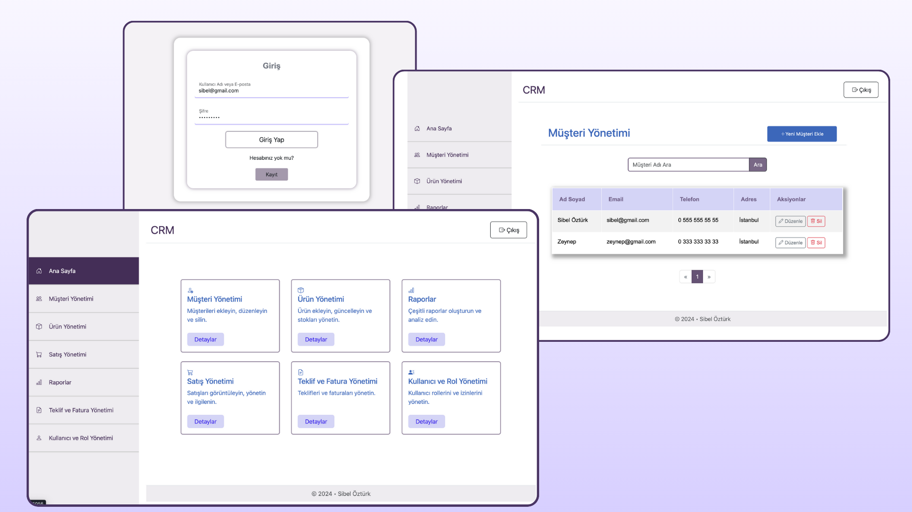

## Customer Relationship Management 

Bu projede, müşteri ve ürün yönetimi işlemleri için geliştirilmiş bir CRM (Müşteri İlişkileri Yönetimi) sistemi bulunmaktadır.

### Kullanılan Teknolojiler

 - **Frontend:**
  Bootstrap

 - **Backend:**
   .Net 8, CQRS Pattern, Repository Pattern, Identity Kütüphanesi, FluentValidation, AutoMapper
   
### Proje Görseli

